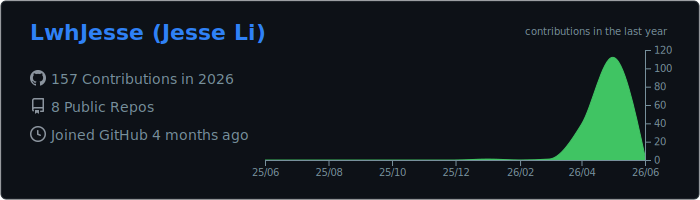
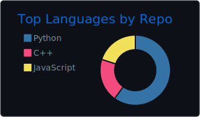
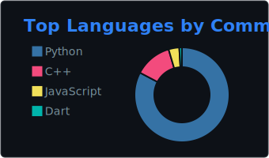
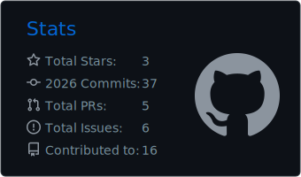
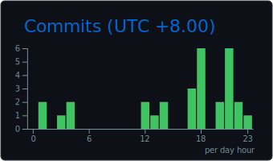

  

### Engineering Mechanics · Numerical Computing · Open Source Systems

C++ / CUDA / Python · CFD / FEM / GPU Linear Algebra · Arch Linux / Hyprland / Neovim

---

## About

Engineering Mechanics undergraduate focused on numerical computing, GPU acceleration, and open-source systems.

I work around CFD solvers, nonlinear mechanics, finite element simulation, GPU linear algebra, and Linux desktop infrastructure.

## Selected Work

- **SU2 GPU linear algebra** — reducing redundant CUDA-side matrix transfers and improving solver data movement.
- **Hyprland rendering** — ICC / blur transparency investigation on a high-refresh 10-bit display pipeline.
- **Nonlinear beam deflection** — numerical computation and FEM validation for large-deflection beam theory limits.
- **OpenSeesPy on AUR** — maintaining structural analysis tooling for Arch Linux users.
- **reinplayer-bin on AUR** — Arch packaging and maintenance.

## Technical Focus

  
  
  
  
  
  

## GitHub Activity

  

  
  

  
  

---

**Mechanics, solvers, GPU, and open source systems.**

